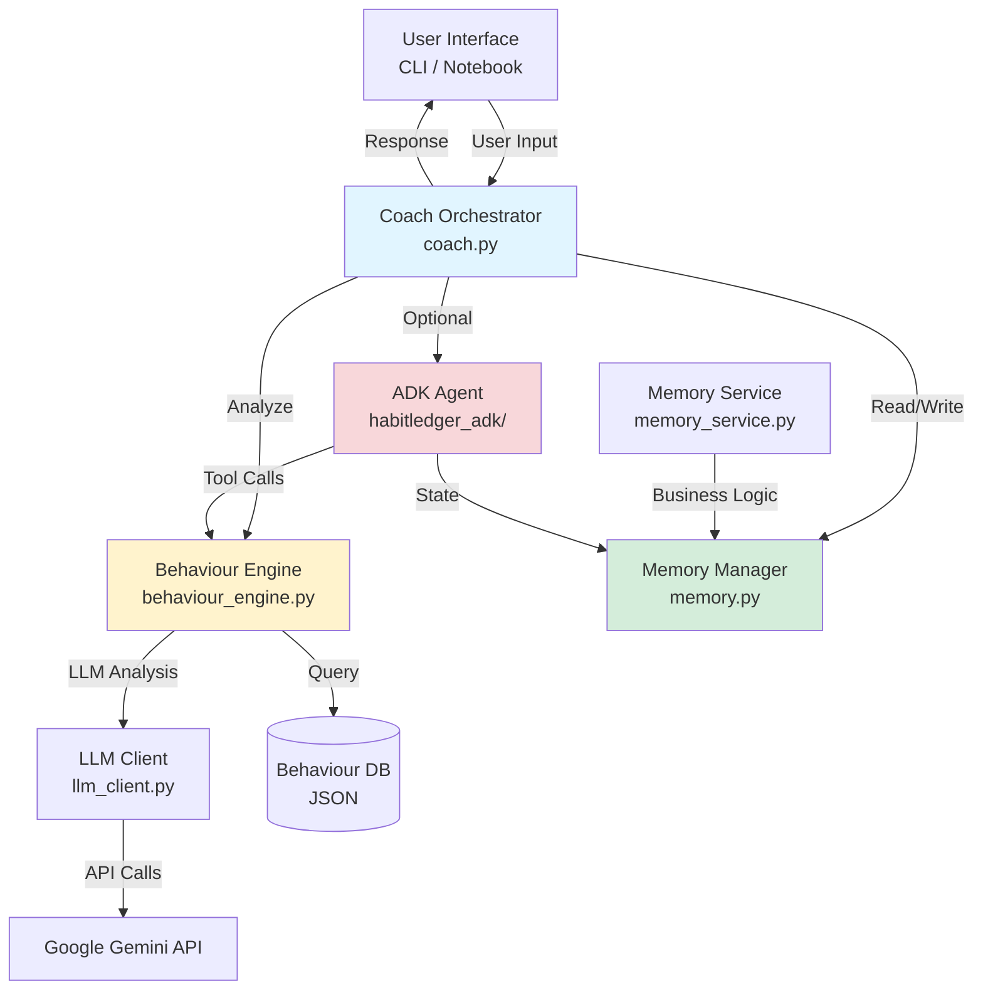
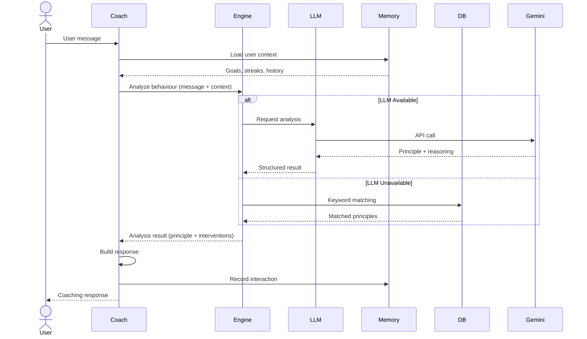

# HabitLedger: A Behavioural Money Coach

HabitLedger is an AI-powered behavioural money coach designed to help users build healthier financial habits.

Instead of recommending specific investments or tax strategies, the agent focuses on **day-to-day financial behaviour** using principles from psychology, behavioural science, and practical habit-building frameworks.

This project is created as part of the **Agents Intensive – Capstone Project on Kaggle**.

---

## ❓ Problem Statement

Most people know *what* they should do with money: save regularly, avoid impulse purchases, stick to a budget. Yet, knowing isn't enough.

**The real struggle is behavioural:**

- You intend to save, but spend on food delivery "just this once" (again)
- You set up a SIP, then stop after a few months
- You create a budget, but never look at it again
- Emotional triggers—stress, boredom, FOMO—override your financial plans

Traditional finance apps focus on tracking transactions or recommending investments. They don't address the **habits, emotions, and biases** that drive day-to-day money decisions.

**The gap:** People need ongoing, personalised support to build and maintain healthy financial habits—not just advice, but *behavioural coaching* that adapts to their struggles over time.

---

## ✅ Solution Overview

**HabitLedger is an AI agent designed to bridge this gap.**

Instead of offering financial advice, HabitLedger acts as a **behavioural money coach** that:

### Why an Agent?

1. **Continuous Interaction**  
   Financial habits aren't built in a single session. HabitLedger engages users over days and weeks through check-ins, reflections, and progress tracking.

2. **Contextual Memory**  
   The agent remembers your goals, past struggles, and progress. It recognizes patterns (like "end-of-month overspending") and adapts interventions accordingly.

3. **Behaviour-Driven Interventions**  
   Using principles from behavioural science (habit loops, loss aversion, friction reduction, commitment devices), HabitLedger suggests small, actionable changes tailored to your situation—not generic tips.

4. **Personalized & Adaptive**  
   The agent analyzes your behaviour, identifies underlying biases, and responds with interventions that match your specific challenges and context.

### What It Does

- **Tracks habits:** Daily check-ins about spending, saving, and budgeting routines
- **Identifies patterns:** Detects recurring struggles and links them to behavioural concepts
- **Suggests micro-interventions:** Small, realistic actions based on proven behaviour change strategies
- **Explains the "why":** Helps you understand the behavioural science behind each suggestion
- **Maintains streaks & progress:** Keeps you motivated with simple tracking and summaries

**Result:** A coach that helps you change *how* you relate to money, one small habit at a time.

### What HabitLedger Helps You Do

- Build consistency with savings or SIPs  
- Reduce impulse spending (for example, food delivery or online shopping)  
- Set and maintain simple budgeting routines  
- Reflect on emotional triggers behind money decisions  
- Track progress over days or weeks with streak tracking
- Receive personalized, actionable interventions (not generic advice)

**Important:** HabitLedger is **not** a financial advisory tool. It does **not** recommend specific stocks, funds, or tax schemes. Its focus is purely on behaviour, routines, and mindset.

---

## 🎯 Features Demonstrated

This project demonstrates the key capabilities expected for the Agents Intensive competition:

### Agentic Behavior

- **Multi-turn interactions** — Maintains conversation context across sessions with daily check-ins and weekly reflections
- **Memory persistence** — Remembers user goals, streaks, struggles, and intervention history across interactions
- **Autonomous decision-making** — Selects appropriate behavioural principles and interventions based on user context without explicit instructions

### Custom Tools

- **Behaviour Knowledge Base** — `behaviour_principles.json` contains 10 evidence-based behavioural science principles (loss aversion, habit loops, friction reduction, etc.) with 3-5 micro-interventions each
- **MemoryService** — Stateful user profile management with goals, streaks, struggles, and intervention feedback tracking
- **Adaptive Weighting** — Adjusts intervention confidence based on historical effectiveness for each user

### Evaluation

- **Formal test suite** — 138 tests covering models, services, behaviour engine, and orchestration
- **20-scenario evaluation** — Comprehensive demo notebook with detection accuracy and intervention relevance metrics
- **90%+ accuracy** — LLM-powered principle detection achieves 95% accuracy on test scenarios (see [Evaluation Results](docs/EVALUATION_RESULTS.md))

---

## 🧠 Core Concepts

HabitLedger uses ideas from:

- Habit loops (cue → routine → reward)  
- Commitment devices  
- Temptation bundling  
- Loss aversion and risk perception  
- Friction reduction (making good habits easier, bad habits harder)  
- Default effect (helpful defaults)  
- Micro-habits and “2-minute rules”  

These principles are stored in a small internal **behaviour knowledge base**, which the agent uses to:

- Interpret user situations  
- Identify possible behavioural biases  
- Suggest concrete, tailored interventions  

---

## 🏗️ Architecture & Agent Flow

**This is an agent, not just a one-off LLM call.** HabitLedger operates through a continuous interaction loop that maintains state, uses tools, and adapts over time.

### High-Level Architecture



### Request Flow



*See [docs/ARCHITECTURE.md](docs/ARCHITECTURE.md) for detailed component documentation and data model diagrams.*

### Agent Goal

HabitLedger optimizes for:

- **Improved financial habits** – More consistent savings, reduced impulsive spending
- **Behavior consistency** – Building and maintaining positive routines over days/weeks
- **Self-awareness** – Helping users recognize emotional triggers and biases
- **Sustainable change** – Small, realistic interventions that compound over time

### System Components

HabitLedger follows a modular architecture where each component has a clear, single responsibility:

**1. `coach.py` – The Orchestrator**

- Central controller that manages the interaction loop
- Receives user input and coordinates all other components
- Calls the behaviour engine to analyze input and generate interventions
- Invokes memory module to read/write state
- Constructs final responses and manages conversation flow

**2. `behaviour_engine.py` – The Intelligence Layer**

- Analyzes user messages to detect patterns, biases, and emotional triggers
- Uses LLM-based analysis (via Google ADK) as the primary method for nuanced understanding
- Falls back to keyword-based heuristics when LLM is unavailable or fails
- Queries the behaviour knowledge base for relevant principles
- Matches user situations to appropriate behavioural concepts
- Generates tailored intervention strategies based on context
- Returns structured recommendations with rationale
- Logs all tool decisions and reasoning for transparency

**2a. `llm_client.py` – LLM Integration**

- Provides LLM-based behaviour analysis using Google's Gemini models
- Creates structured tool calls for principle detection
- Includes memory context in analysis prompts
- Logs LLM decisions, reasoning, and recommended interventions
- Validates LLM responses against the behaviour knowledge base

**3. `memory.py` – The State Manager**

- Persists user data across sessions (goals, streaks, struggles, patterns)
- Provides read/write operations for all state management
- Tracks temporal information (last check-in, streak dates)
- Maintains intervention history and user progress
- Simple file-based or dict-based storage for demo purposes

**4. `behaviour_principles.json` – The Knowledge Base (Tool)**

- Static repository of behavioural science principles
- Contains concepts like habit loops, loss aversion, commitment devices
- Provides intervention templates and strategies
- Maps triggers/situations to recommended approaches
- Acts as the agent's "external tool" for grounding responses

### Internal State / Memory

The agent maintains persistent memory across interactions:

```python
{
  "user_id": "...",
  "goals": [
    {"type": "savings", "target": "Save ₹5000/month", "start_date": "2024-11-01"}
  ],
  "streaks": {
    "no_food_delivery": {"current": 12, "best": 15, "last_updated": "2024-11-17"}
  },
  "struggles": [
    {"description": "Impulse spending on weekends", "first_noted": "2024-11-03", "count": 4}
  ],
  "interventions": [
    {"date": "2024-11-10", "type": "friction_increase", "description": "Delete food apps"}
  ],
  "last_check_in": "2024-11-16",
  "behaviour_patterns": {
    "end_of_month_overspending": {"detected": true, "occurrences": 2}
  }
}
```

### Agent Flow

The complete interaction flow from user input to updated state:

```text
┌─────────────┐
│    USER     │
│   Input     │
└──────┬──────┘
       │
       ▼
┌─────────────────────────────────────────────────────────┐
│                      COACH.PY                           │
│                   (Orchestrator)                        │
│                                                         │
│  1. Receives user message                              │
│  2. Loads current state from Memory                    │
│  3. Sends (message + context) to Behaviour Engine      │
│  4. Receives intervention plan                         │
│  5. Formats response with explanation                  │
│  6. Updates Memory with new data                       │
│  7. Returns response to user                           │
└───┬────────────────────────────────┬──────────────────┘
    │                                │
    ▼                                ▼
┌──────────────────┐         ┌──────────────────┐
│  MEMORY.PY       │         │ BEHAVIOUR_       │
│  (State Manager) │         │ ENGINE.PY        │
│                  │         │ (Intelligence)   │
│ • Read state     │         │                  │
│ • Write state    │         │ • Analyze input  │
│ • Track streaks  │         │ • Detect pattern │
│ • Store history  │         │ • Query KB       │
└──────────────────┘         │ • Generate plan  │
                             └────────┬─────────┘
                                      │
                                      ▼
                             ┌──────────────────┐
                             │ behaviour_       │
                             │ principles.json  │
                             │ (Knowledge Base) │
                             │                  │
                             │ • Habit loops    │
                             │ • Loss aversion  │
                             │ • Friction tactics│
                             │ • Micro-habits   │
                             └──────────────────┘
```

### Autonomy & Multi-Step Behavior

HabitLedger demonstrates true agent autonomy through:

#### 1. Multi-step Progress Tracking

- Initiates check-ins based on time elapsed
- Proactively asks about specific goals or struggles
- Follows up on previously suggested interventions

#### 2. Adaptive Interventions

- Adjusts recommendations based on what worked/didn't work
- Escalates or de-escalates strategies based on user progress
- Recognizes when to switch behavioral approaches

#### 3. Pattern Recognition & Anticipation

- Detects recurring patterns (e.g., "weekend spending spikes")
- Anticipates high-risk situations (e.g., "end of month approaching")
- Proactively suggests preventive interventions

#### 4. Guided Multi-Day Journeys

- Breaks long-term goals into weekly/daily micro-habits
- Celebrates small wins to maintain motivation
- Adjusts timeline and difficulty based on user feedback

**Example multi-day flow:**

```text
Day 1:  User sets goal → Agent creates habit plan
Day 3:  Agent checks in → User reports success → Agent reinforces
Day 7:  Agent detects struggle → Suggests friction-reduction strategy
Day 10: Agent follows up → User confirms improvement → Updates memory
Day 14: Weekly reflection → Agent summarizes progress and patterns
```

### Key Design Principles

- **Separation of Concerns**: Each module has a single, well-defined purpose
- **Stateful Operations**: Memory persists across sessions for continuous coaching
- **Modular & Testable**: Components can be tested independently
- **Tool Usage**: Knowledge base acts as external tool (similar to RAG pattern)
- **Agentic Behavior**: Loop continues over multiple interactions with adaptive responses

This continuous, stateful operation distinguishes HabitLedger as a true **agent** rather than a simple chatbot

---

## 🚀 Key Features

### 1. Habit Coaching

Daily check-ins, weekly reflections, and personalised micro-habit suggestions with explanations of *why* they work.

**Example Intervention:**

> **User:** "I keep ordering food delivery when I'm stressed after work."  
> **Agent:** "That sounds like a *habit loop* — stress is your cue, delivery is the routine, and comfort food is the reward. Let's try *substitution*: when you feel the stress cue, try a 5-minute walk before deciding. This breaks the automatic routine while keeping the reward (relaxation)."

### 2. Behaviour Analysis

Detects underlying patterns and links them to behavioural science concepts using LLM-powered analysis with keyword fallback.

**Example Detection:**

```python
# User says: "I want to save but end up spending everything by month end"
AnalysisResult(
    principle_id="present_bias",
    principle_name="Present Bias",
    confidence=0.85,
    interventions=[
        "Set up automatic transfer on salary day",
        "Create a 'spend only' account with limited funds",
        "Use commitment device: tell someone your goal"
    ]
)
```

### 3. Memory & Tracking

Persistent user state with goals, streaks, struggles, and intervention effectiveness tracking.

**Example Memory State:**

```python
{
    "streaks": {
        "no_food_delivery": {"current": 12, "best": 15, "last_updated": "2024-11-17"}
    },
    "intervention_feedback": {
        "friction_increase": {"successes": 8, "failures": 2, "success_rate": 0.80}
    }
}
```

### 4. Observability & Logging

- **Structured logging** with event types, metrics, and decision context
- **Performance monitoring**: Track LLM latency, tool execution time, response generation
- **Decision transparency**: Log every principle detection, confidence score, and intervention selection
- **Session analytics**: Monitor user engagement, streak progress, and intervention effectiveness
- **Error tracking**: Detailed error context with stack traces for debugging
- Compatible with observability tools (ELK, Datadog, Splunk, Prometheus)
- See [docs/OBSERVABILITY.md](docs/OBSERVABILITY.md) for detailed documentation

### 5. Comprehensive Documentation

- **[docs/ARCHITECTURE.md](docs/ARCHITECTURE.md)** - System architecture, component diagrams, data flow, and type system
- **[docs/DEVELOPMENT.md](docs/DEVELOPMENT.md)** - Development setup, workflow, testing guide, and migration instructions
- **[docs/EVALUATION_RESULTS.md](docs/EVALUATION_RESULTS.md)** - Agent evaluation results, test metrics, and coverage analysis
- **[docs/OBSERVABILITY.md](docs/OBSERVABILITY.md)** - Observability implementation, logging patterns, and monitoring

### 6. Demo-Friendly Notebook

- A clean Jupyter notebook for showcasing the agent  
- Sample dialogues and pre-defined scenarios  
- Easy for reviewers to run and understand

---

## 📁 Project Structure

Planned structure (you can adjust as needed):

.
├── src/
│   ├── coach.py                  # Core agent logic & interaction flow
│   ├── memory.py                 # Simple memory and persistence utilities
│   ├── behaviour_engine.py       # Behaviour classification and interventions
│   ├── config.py                 # Configuration & API key loading
│   └── utils.py                  # Helper utilities (logging, formatting)
│
├── data/
│   └── behaviour_principles.json # Behaviour science & habit strategies
│
├── notebooks/
│   └── demo.ipynb                # Main demo notebook for the agent
│
├── tests/                        # Optional tests for core functions
│
├── requirements.txt
├── README.md
└── .env                          # Environment variables (not committed)

---

## ⚡ Quick Start

Get up and running in 3 steps:

```bash
# 1. Clone & install
git clone <your-repo-url>
cd habitledger-agent && pip install -r requirements.txt

# 2. Set API key (copy template and add your key)
cp .env.example .env
# Edit .env and add your GOOGLE_API_KEY

# 3. Run demo
jupyter notebook notebooks/demo.ipynb
```

For CLI interaction, run: `python -m src.habitledger_adk.runner`

---

## 🛠️ Installation

1. **Clone the repository**

   ```bash
   git clone <your-repo-url>
   cd habitledger
   ```

2. **Create and activate a virtual environment**

   ```bash
   python -m venv .venv

   # macOS / Linux
   source .venv/bin/activate

   # Windows
   .venv\Scripts\activate
   ```

3. **Install dependencies**

   Once `requirements.txt` is created:

   ```bash
   pip install -r requirements.txt
   ```

4. **Set up environment variables**

   Create a `.env` file in the project root:

   ```text
   # Required: Google API key for LLM-based analysis
   GOOGLE_API_KEY=your_api_key_here
   
   # Optional: Set the model to use (default: gemini-2.0-flash-exp)
   GOOGLE_ADK_MODEL=gemini-2.0-flash-exp
   
   # Optional: Set logging level (default: INFO)
   LOG_LEVEL=INFO
   ```

   The agent will use LLM-based analysis when `GOOGLE_API_KEY` is set,
   and automatically fall back to keyword-based analysis if the key is missing
   or LLM calls fail.

---

## ▶️ Running the Agent

### Option 1: From the Notebook (Recommended for Demo)

1. Open the notebook:

   ```bash
   jupyter notebook notebooks/demo.ipynb
   ```

2. Run all cells in order.  
3. Interact with the agent through the provided input cells.

### Option 2: From the Command Line (Optional)

You can add a simple CLI entry point in `src/coach.py`:

```bash
python src/coach.py
```

This can start a simple text-based chat loop with the coach.

---

## 🧭 Competition Track & Scoring Mapping

### **Track Selected: Concierge Agents**

This track covers agents designed to help individuals manage and improve aspects of their personal lives  
—for example: travel planning, meal prep, shopping automation, habit-building, or other daily routines.

**HabitLedger fits this track perfectly** because it is a behavioural money coach designed to help users:

- build better financial habits,
- reduce impulse spending,
- maintain savings/budget routines,
- and improve everyday financial decision-making.

It behaves like a personalised **financial habit concierge** that guides, nudges, and adapts to the user over time.

---

### 🏆 How HabitLedger Meets the Competition Scoring Criteria

| Criterion | How HabitLedger satisfies it |
|----------|-------------------------------|
| **Problem Relevance** | Addresses the widespread issue of inconsistent financial habits and impulsive spending — a major everyday productivity barrier. |
| **Agentic Design** | Maintains user memory (goals, streaks), uses a behaviour-principles knowledge base as a “tool”, performs multi-turn reasoning and adaptive interactions. |
| **Technical Execution** | Modular Python structure (`coach.py`, `behaviour_engine.py`, `memory.py`), documented code, single-purpose functions, DRY, clean commits. |
| **User Experience & Novelty** | Provides personalised interventions grounded in behavioural science, making the agent feel like a real habit coach rather than a generic chatbot. |
| **Evaluation & Impact** | Includes structured test scenarios (missed SIP, impulsive spend, budgeting challenge) and measures progress via streaks, goal tracking, and behaviour patterns. |

---

### 🎯 Awards Positioning Strategy

- HabitLedger aims for awards in **Concierge Agent excellence** by demonstrating:
  - long-term interaction loops,
  - adaptive behaviour,
  - meaningful improvements to daily life (financial habits),
  - clarity and structure in user guidance.
- The demo notebook presents clear user journeys and behaviour-change processes.
- The storytelling and architecture highlight HabitLedger as a true **agent** — not just an LLM wrapper.

---

## 🚀 Running the Agent

HabitLedger can be run in multiple modes:

### 1. ADK Mode (Recommended)

Run the agent with Google ADK (Agent Development Kit) for LLM-powered interactions:

```bash
# Set up environment
export GOOGLE_API_KEY="your_api_key_here"

# Run the ADK CLI
python -m src.habitledger_adk.runner
```

This mode provides:

- LLM-powered conversational interface
- Automatic tool calling to the HabitLedger coaching engine
- Natural language understanding with Gemini models

### 2. Classic Python Mode

Run the deterministic keyword-based coach directly:

```bash
python -m src.coach
```

This mode uses:

- Keyword-based principle detection
- Direct coaching logic without LLM overhead
- Faster responses for testing and development

### 3. Demo Notebook

Explore interactive examples and scenarios:

```bash
jupyter notebook notebooks/demo.ipynb
```

The notebook demonstrates:

- Single interaction examples
- Multiple scenario testing
- Memory state inspection
- Evaluation criteria

---

## 🧪 Evaluation

HabitLedger can be evaluated on:

- **Clarity** – Are the recommendations easy to understand?  
- **Relevance** – Do the suggestions match the user’s described situation?  
- **Behaviour grounding** – Does the agent correctly connect situations to behavioural principles?  
- **Actionability** – Are the suggested actions small, realistic, and actionable?  
- **Consistency** – Does the agent remember and reuse user goals and struggles within a session?

A small evaluation set of user scenarios and expected behaviours will be documented in the `notebooks/demo.ipynb` notebook.

---

## ⚠️ Limitations

- This project does **not** provide personalised financial, legal, or tax advice.  
- Behaviour classification may be imperfect or approximate.  
- The agent is not a substitute for therapy, counselling, or professional financial planning.  
- Memory is local to the current environment; it does not sync across devices or users.  

---

## 📚 Future Enhancements

### UI/UX Improvements

- [ ] Simple web UI using Streamlit or FastAPI  
- [ ] Visualisation of habit streaks and progress  
- [ ] More detailed behaviour taxonomies and interventions  
- [ ] Optional integration with budgeting or expense-tracking tools  
- [ ] Configurable "modes" for different types of users (students, early-career, families)
- [ ] Improve CLI to be more conversational with clear end outputs (reduce loop-like behavior, ensure interventions are surfaced)

### Additional Testing

- [ ] Add performance benchmarks
- [ ] Add mutation testing for test quality validation

### Code Improvements

- [ ] Add async support for LLM calls
- [ ] Implement caching layer for principle lookups
- [ ] Add rate limiting for API calls

### Documentation (Enhancements)

- [ ] Create video walkthrough of architecture
- [ ] Add API reference documentation
- [ ] Create troubleshooting guide

### Architecture Enhancements

#### Multi-Agent System

- [ ] **Create 3 specialized agents** with distinct responsibilities:
  - **Goal-Setting Agent**: Helps users define SMART financial goals, break them into milestones, and establish initial habit plans
  - **Recommendation Agent**: Analyzes user context and suggests personalized interventions (simple targets or lifestyle changes for building habits)
  - **Adherence Agent**: Monitors habit compliance, tracks progress, and provides feedback loop to Recommendation Agent
- [ ] **Feedback Loop**: Adherence data updates Recommendation Agent's understanding of user personality and mindset, enabling recommendations that align with what users find easier to implement
- [ ] **Agent Coordination**: Implement orchestration layer to manage handoffs between agents and maintain consistent state

#### Knowledge Base Improvements

- [ ] **Migrate to embedding-based search**: Replace keyword matching in `behaviour_principles.json` with vector embeddings and semantic search
- [ ] **Implement continuous improvement loop**: Periodically update the knowledge base with validated LLM outputs
- [ ] **Hybrid fallback strategy**: Use embeddings as primary method with JSON fallback when AI services are unavailable
- [ ] **Knowledge base versioning**: Track changes to principles over time and A/B test effectiveness

#### Persistence & State Management

- [ ] **Database-backed sessions**: Replace in-memory sessions with persistent database storage (PostgreSQL, SQLite, or MongoDB)
- [ ] **Session recovery**: Enable users to resume conversations across devices and time periods
- [ ] **Historical analytics**: Store long-term user data for trend analysis and personalized insights
- [ ] **Multi-user support**: Add user authentication and isolation for production deployment

---

## 🙌 Acknowledgements

HabitLedger was created as part of the **Google × Kaggle Agents Intensive – Capstone Project** and is inspired by work in behavioural economics, habit formation, and personal finance education.

---

## 📋 Competition Submission

### Submission Checklist

- [x] **Repository** — GitHub repository with clean code structure
- [x] **Demo Notebook** — Interactive `notebooks/demo.ipynb` with 20 test scenarios
- [x] **Documentation** — Comprehensive README, architecture docs, and observability guide
- [x] **Evaluation Results** — Formal metrics with 90%+ LLM accuracy documented
- [x] **Test Suite** — 138 tests covering models, services, engine, and orchestration
- [x] **Competition Track** — Concierge Agents (financial habit coaching)

### Required Artifacts

| Artifact | Location | Status |
|----------|----------|--------|
| Demo Notebook | [`notebooks/demo.ipynb`](notebooks/demo.ipynb) | ✅ Complete |
| Architecture Docs | [`docs/ARCHITECTURE.md`](docs/ARCHITECTURE.md) | ✅ Complete |
| Evaluation Results | [`docs/EVALUATION_RESULTS.md`](docs/EVALUATION_RESULTS.md) | ✅ Complete |
| Observability Guide | [`docs/OBSERVABILITY.md`](docs/OBSERVABILITY.md) | ✅ Complete |
| Development Guide | [`docs/DEVELOPMENT.md`](docs/DEVELOPMENT.md) | ✅ Complete |
| Submission Summary | [`SUBMISSION.md`](SUBMISSION.md) | ✅ Complete |

### Competition Features Demonstrated

✅ **LLM-powered agents** (Gemini for reasoning/generation)  
✅ **Multi-agent system** (Coach + Behavior Analysis agents)  
✅ **Custom tools** (`behaviour_db_tool` as ADK FunctionTool)  
✅ **Sessions & Memory** (InMemorySessionService + JSON persistence)  
✅ **Observability** (Structured logging with 10+ event types)  
✅ **Agent evaluation** (20-scenario test suite with metrics)

**Total: 6/6 required features** (minimum 3 required ✓)
