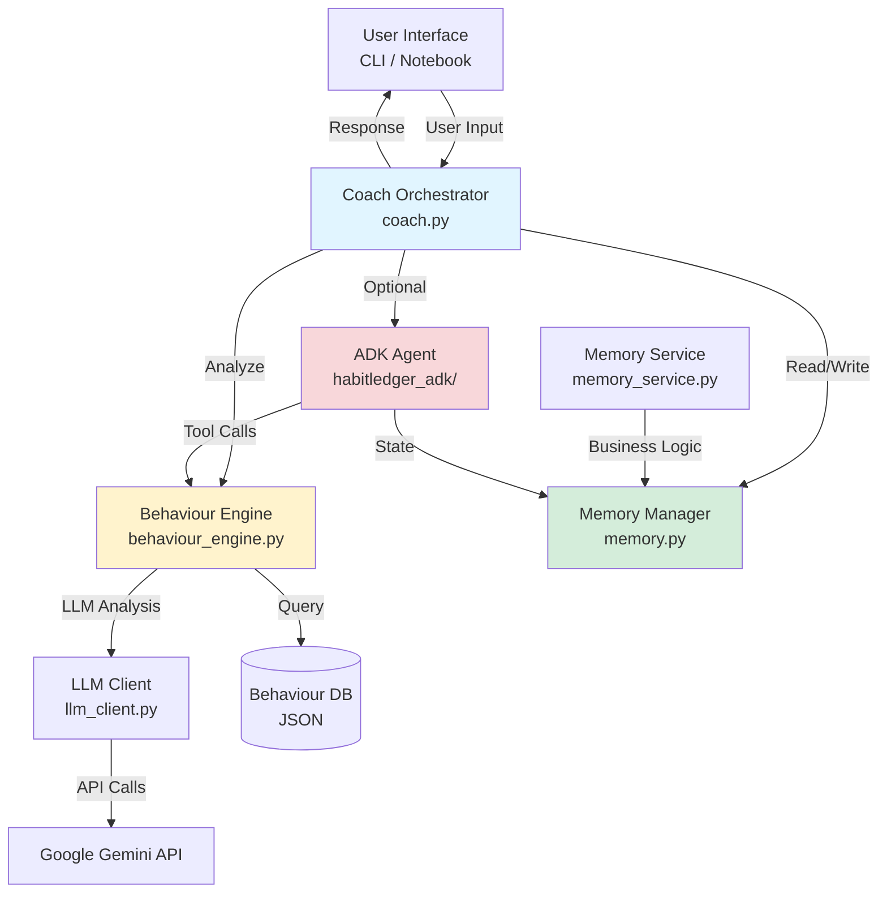
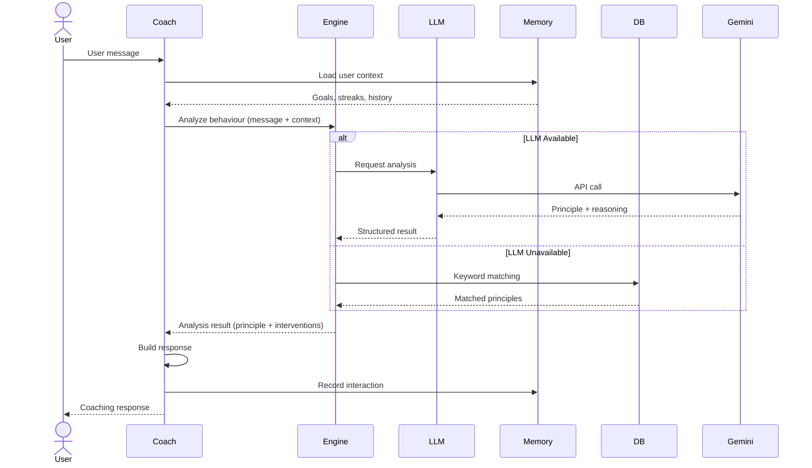
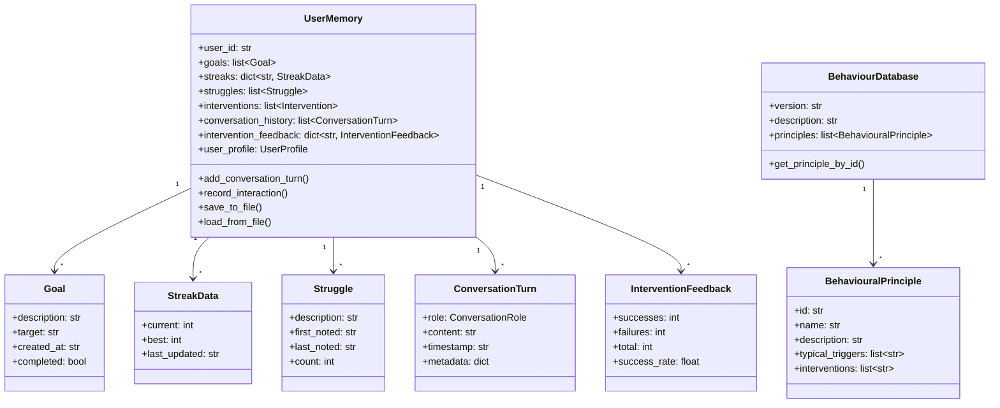
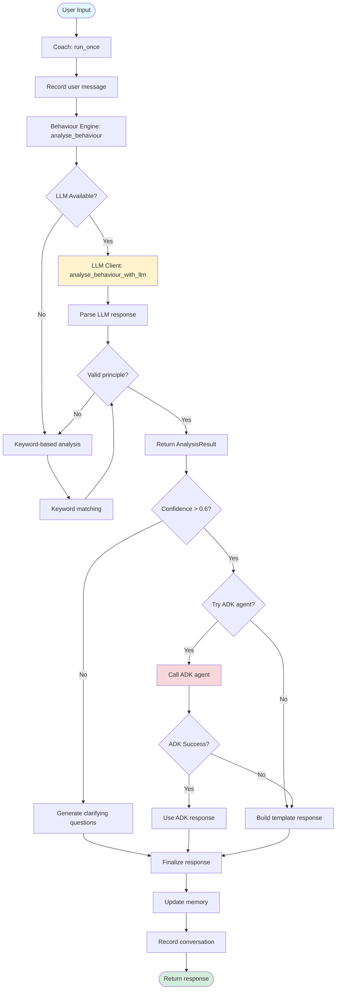
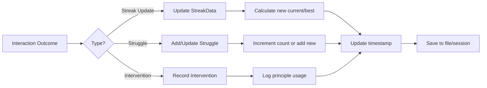

# HabitLedger Architecture

This document provides an in-depth architectural overview of the HabitLedger agent system, including system diagrams, data flow, and component interactions.

## Table of Contents

- [System Overview](#system-overview)
- [Architecture Diagrams](#architecture-diagrams)
- [Component Details](#component-details)
- [Data Flow](#data-flow)
- [Type System](#type-system)

## System Overview

HabitLedger follows a clean, layered architecture with clear separation of concerns:

- **Presentation Layer**: CLI, Jupyter notebooks
- **Application Layer**: Coach orchestrator, response generation
- **Business Logic Layer**: Behaviour analysis, memory services
- **Data Layer**: UserMemory, behaviour database
- **External Services**: Google GenAI (Gemini), ADK framework

## Architecture Diagrams

### High-Level System Architecture



### Request Flow Diagram



### Data Model Architecture



### Component Interaction Flow



## Component Details

### Coach (coach.py)

**Responsibility**: Central orchestrator for agent interactions

**Key Functions**:

- `run_once(user_input, memory, behaviour_db)`: Main entry point for processing user input
- `_handle_low_confidence_case()`: Generates clarifying questions for uncertain detections
- `_build_template_response()`: Creates fallback responses without ADK
- `_finalize_response()`: Records responses in memory and returns to user
- `call_adk_agent()`: Optional integration with Google ADK for enhanced responses
- `generate_session_summary()`: Creates progress summaries

**Dependencies**: behaviour_engine, memory, llm_client, models, adk_config, adk_tools

### ADK Config (adk_config.py)

**Responsibility**: Shared ADK configuration to prevent circular dependencies

**Key Content**:

- `INSTRUCTION_TEXT`: System prompt/instruction text for ADK agents
- Shared constant used by both `coach.py` and `habitledger_adk/agent.py`
- Eliminates circular import between coach and ADK agent modules

**Purpose**: This module was created as part of the "Extract Shared Components" pattern to resolve circular dependencies between the coach orchestrator and ADK agent implementation.

### ADK Tools (adk_tools.py)

**Responsibility**: Shared ADK tool definitions

**Key Functions**:

- `behaviour_db_tool()`: Returns behaviour database tool function
- `create_behaviour_db_function_tool()`: Creates FunctionDeclaration for Gemini models
- `get_behaviour_db_tool()`: Returns ADK FunctionTool wrapper

**Purpose**: Centralizes behaviour database tool definitions to prevent duplication and circular imports. Used by both coach orchestrator and ADK agent for consistent tool integration.

### Behaviour Engine (behaviour_engine.py)

**Responsibility**: Behavior pattern detection and intervention mapping

**Key Functions**:

- `analyse_behaviour()`: Primary analysis function (tries LLM, falls back to keywords)
- `_analyse_behaviour_keyword()`: Keyword-based principle detection
- `_apply_adaptive_weighting()`: Adjusts confidence based on historical effectiveness
- `explain_principle()`: Generates behavioral explanations
- `get_interventions()`: Retrieves intervention suggestions
- `load_behaviour_db()`: Loads behavior knowledge base

**Detection Flow**:

1. Try LLM-based analysis (if available)
2. Fall back to keyword matching
3. Apply adaptive weighting based on user history
4. Return structured AnalysisResult

### LLM Client (llm_client.py)

**Responsibility**: LLM integration for nuanced behavior analysis

**Key Functions**:

- `analyse_behaviour_with_llm()`: Main LLM analysis entry point
- `_build_llm_prompt()`: Constructs context-aware prompts
- `_parse_llm_response()`: Extracts structured data from LLM
- `_validate_principle()`: Ensures detected principles exist in DB
- `_build_memory_context()`: Formats user context for LLM

**LLM Configuration**:

- Model: Gemini 2.0 Flash (configurable)
- Temperature: 0.3 (for consistent analysis)
- Tool: behaviour_analysis function declaration

### Memory Manager (memory.py)

**Responsibility**: User state persistence and retrieval

**Key Capabilities**:

- Goal tracking
- Streak management
- Struggle recording
- Conversation history
- Intervention feedback
- User profile personalization

**Serialization**:

- JSON file-based persistence
- ADK session state integration
- Type-safe serialization/deserialization

### Memory Service (memory_service.py)

**Responsibility**: Business logic for memory operations

**Static Methods**:

- `record_interaction()`: Records streak updates, struggles, interventions
- `record_feedback()`: Tracks intervention effectiveness
- `calculate_principle_effectiveness()`: Computes success rates
- `get_recent_struggles()`: Retrieves latest struggles
- `get_active_streaks()`: Filters active habits
- `get_broken_streaks()`: Identifies rebuilding opportunities
- `get_principle_usage_count()`: Counts principle applications

## Data Flow

### Interaction Flow

1. **Input Reception**
   - User provides message through CLI or notebook
   - Message includes context (goals, current state)

2. **Context Loading**
   - Coach loads UserMemory from file/session
   - Memory includes goals, streaks, conversation history

3. **Behavior Analysis**
   - Behaviour Engine receives input + memory context
   - LLM Client attempts intelligent analysis
   - Falls back to keyword matching if needed
   - Returns AnalysisResult with principle and interventions

4. **Response Generation**
   - Low confidence → Ask clarifying questions
   - High confidence → Try ADK agent (optional)
   - Fallback → Template-based response
   - Always includes principle explanation

5. **State Update**
   - Record conversation turn
   - Update streaks/struggles as needed
   - Track intervention effectiveness
   - Save updated memory

6. **Response Delivery**
   - Return formatted coaching response
   - Include behavioral explanation
   - Provide actionable interventions

### Memory Update Flow



## Type System

HabitLedger uses a strongly-typed domain model with dataclasses for type safety and validation.

### Core Types

**Enums**:

- `ConversationRole`: USER, ASSISTANT, SYSTEM
- `BehaviourPrincipleEnum`: LOSS_AVERSION, HABIT_LOOPS, etc.

**Data Models**:

- `Goal`: Financial goals with targets and completion status
- `StreakData`: Habit streak tracking with current/best counts
- `Struggle`: User challenges with frequency tracking
- `Intervention`: Recorded coaching actions
- `ConversationTurn`: Chat history with metadata
- `InterventionFeedback`: Effectiveness tracking per principle
- `BehaviouralPrinciple`: Knowledge base entries
- `BehaviourDatabase`: Principle collection with lookup
- `AnalysisResult`: Structured analysis output

### Type Safety Benefits

1. **Compile-time validation**: Type checkers catch errors early
2. **IDE support**: Autocomplete and inline documentation
3. **Runtime safety**: Dataclass validation prevents invalid data
4. **Serialization**: Consistent to_dict/from_dict patterns
5. **Testability**: Easy to create test fixtures

## Testing Strategy

### Test Coverage

- `test_models.py`: Dataclass validation and serialization
- `test_memory_service.py`: Business logic and state updates
- `test_behaviour_engine.py`: Principle detection and matching
- `test_coach.py`: Response generation and orchestration
- `test_utils.py`: Helper functions

### Test Fixtures

- `conftest.py` provides reusable fixtures:
  - `sample_behaviour_db`: Test behaviour database
  - `empty_memory`: Clean UserMemory instance
  - `populated_memory`: UserMemory with sample data
  - `sample_user_input`: Test scenarios

### Running Tests

```bash
# Run all tests
pytest tests/

# Run with coverage
pytest tests/ --cov=src --cov-report=html

# Run specific test file
pytest tests/test_models.py -v
```

## Deployment Considerations

### Environment Configuration

```bash
# Required
GOOGLE_API_KEY=your_api_key

# Optional
GOOGLE_ADK_MODEL=gemini-2.0-flash-exp
LOG_LEVEL=INFO
```

### Scalability

Current design is single-user focused. For multi-user:

1. Replace file-based persistence with database
2. Implement user authentication/sessions
3. Add rate limiting for LLM calls
4. Cache behaviour database in memory
5. Implement async processing for long operations

### Observability

See [OBSERVABILITY.md](OBSERVABILITY.md) for:

- Structured logging patterns
- Performance metrics
- Decision tracing
- Error handling
